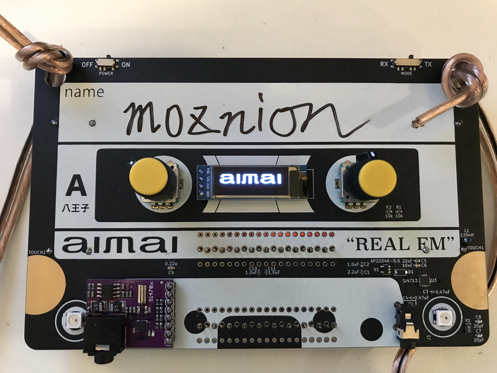

(Japanese doc is here: [README_ja](./README_ja.md))


aimai is an "FM transceiver" name tag based on ESP32.



## Features

- FM radio receiver
  - Receiving sound
  - Receiving text data with [Radio Data System (RDS)](https://wikipedia.org/wiki/Radio_Data_System)
- FM radio transmitter
  - Transmitting sound
  - Transmitting text data with RDS
- Write your name on the board :)

## How to use

### Receiving (RX mode)

HIGHLY RECOMMENDED: it should be plugged earphones into the RX module's (purple one) phone jack because the earphones line works as an antenna. If not, it might be not able to receive text data through RDS.

- Turn on the device (by toggle switch at the top of left)
- Switch to the RX mode (by toggle switch at the top of right)
- The left knob: adjust the loudness
- The right knob: adjust the RX frequency
- OLED display: it shows received text data

### Transmitting (TX mode)

- Turn on the device (by toggle switch at the top of left)
- Switch to the TX mode (by toggle switch at the top of right)
- This mode transmits sound data through the TX module (the right one) line
- The left knob: RDS text input
  - Turn the knob, it chooses the characters
  - Click the knob, it decides a character
  - It needs to input 20 characters (hint: it supports the space character)
- The right knob: adjust the TX frequency
  - Click the knob, this is an escape key (i.e. leave from text input mode)
- OLED display: it shows transmitting text data

## How to build and upload the binary to ESP32 board

### Requirements

- [platformio](https://platformio.org)

### How to bootstrap the project

```
$ make bootstrap
```

### How to build

```
$ make build
```

### How to upload

```
$ make upload
```

If you have something trouble, please edit the `upload_port` configuration on [platformio.ini](./platformio.ini).

## How to construct the board

A schematic and PCB data are here: [pcb](./pcb)

## Note

This project is optimized for Japan coverage. If you would like to use this device in countries other than Japan, you should modify the code of frequency band for `Si4703` and `Si4713`.

## Makers

- [uzulla](https://github.com/uzulla)
- [mackee](https://github.com/mackee)
- [moznion](https://github.com/moznion)

